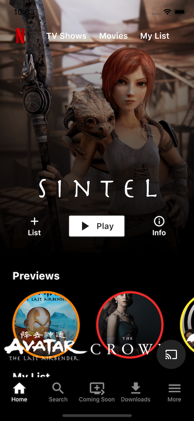

# Flutter Netflix Responsive UI Tutorial | Web and Mobile 🎬📱💻

Welcome to the Flutter Netflix Responsive UI Tutorial project! This tutorial is designed to help you build a responsive user interface (UI) inspired by Netflix, suitable for both web and mobile platforms using Flutter.

## Overview

In this tutorial, you'll learn how to create a visually appealing and functional UI similar to Netflix. You'll implement features such as a custom navigation bar, carousel sliders, movie categories, and responsive layouts for different screen sizes.

## Features

- **Custom Navigation Bar:**
  - Implement a bottom navigation bar with custom icons and navigation logic.

- **Carousel Sliders:**
  - Display movie posters in carousel sliders with smooth animations.

- **Movie Categories:**
  - Organize movies into categories such as Trending, Action, Drama, etc.

- **Responsive Layouts:**
  - Design layouts that adapt to various screen sizes, including mobile and web.

## Technologies Used

- **Flutter:**
  - UI toolkit for building natively compiled applications for mobile, web, and desktop from a single codebase.

- **Flutter Web:**
  - Platform-specific features and configurations for web development.

- **Third-Party Packages:**

## How to Run

1. **Clone the Repository:**
   

Follow Flutter's standard run commands for web and mobile platforms.
Screenshots

Contribution
Contributions to enhance the tutorial or add new features are welcome! If you have ideas for improvements or additional functionalities, feel free to open an issue or submit a pull request.

License
This project is licensed under NONE

Let's create a stunning Netflix-inspired UI with Flutter! 🎬🍿

Feel free to customize this template based on your specific tutorial content and project requirements. Happy coding! 🚀
